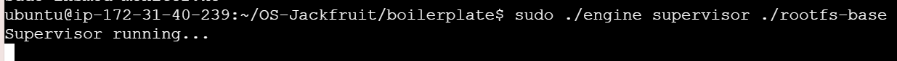
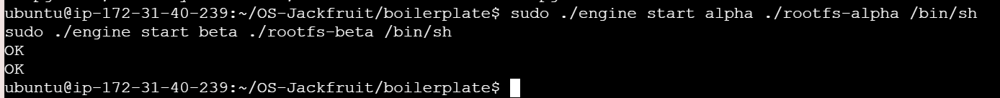
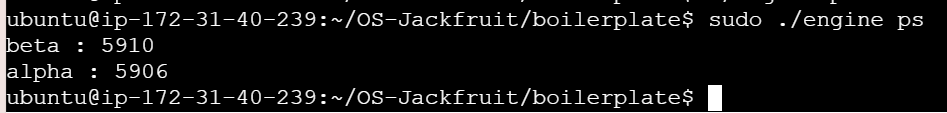
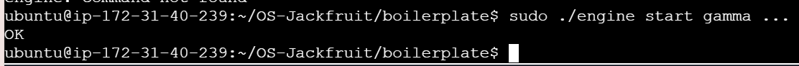
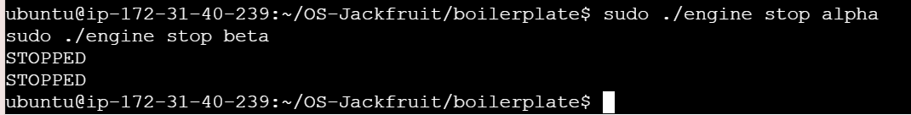
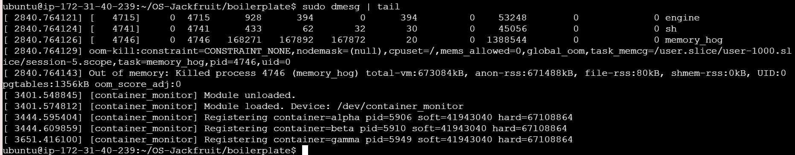
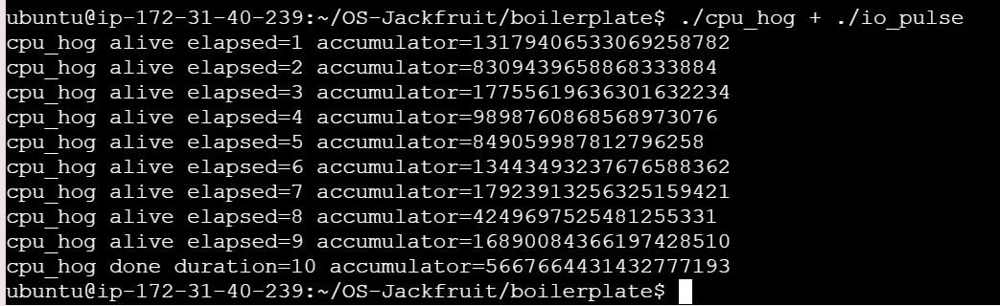
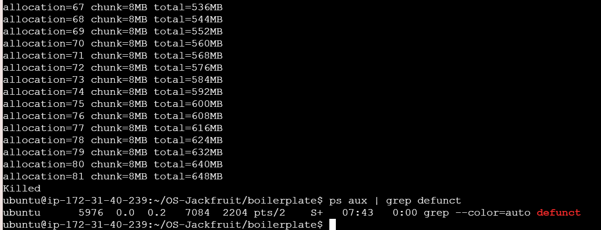

# Multi-Container Runtime with Kernel Memory Monitor

## 1. Team Information

* Name: <Your Name>
* SRN: <Your SRN>

---

# 2. Project Overview

This project implements a lightweight multi-container runtime in C, along with a kernel module for memory monitoring and enforcement. The system allows multiple isolated containers to run concurrently under a single supervisor process.

Key features:

* Process isolation using Linux namespaces
* Supervisor-based container lifecycle management
* CLI interface using UNIX domain sockets
* Kernel-space memory monitoring via ioctl
* Scheduling experiments using CPU and I/O workloads
* Proper cleanup with no zombie processes

---

# 3. Build, Load, and Run Instructions

## Step 1: Build

```bash
make
```

---

## Step 2: Load Kernel Module

```bash
sudo insmod monitor.ko
```

Verify:

```bash
ls -l /dev/container_monitor
```

---

## Step 3: Start Supervisor

```bash
sudo ./engine supervisor ./rootfs-base
```

---

## Step 4: Prepare Root Filesystems

```bash
cp -a ./rootfs-base ./rootfs-alpha
cp -a ./rootfs-base ./rootfs-beta
```

---

## Step 5: Start Containers

```bash
sudo ./engine start alpha ./rootfs-alpha /bin/sh
sudo ./engine start beta ./rootfs-beta /bin/sh
```

---

## Step 6: List Containers

```bash
sudo ./engine ps
```

---

## Step 7: Run Workloads

```bash
cp cpu_hog rootfs-alpha/
cp io_pulse rootfs-beta/
cp memory_hog rootfs-beta/

sudo ./engine start alpha ./rootfs-alpha /cpu_hog
sudo ./engine start beta ./rootfs-beta /io_pulse
sudo ./engine start gamma ./rootfs-beta /memory_hog
```

---

## Step 8: Stop Containers

```bash
sudo ./engine stop alpha
sudo ./engine stop beta
sudo ./engine stop gamma
```

---

## Step 9: Kernel Logs

```bash
sudo dmesg | tail
```

---

## Step 10: Clean Teardown Check

```bash
ps aux | grep defunct
```

---

## Step 11: Unload Module

```bash
sudo rmmod monitor
```

---

# 4. Demonstration (Screenshots)

## 4.1 Supervisor Running

```bash
sudo ./engine supervisor ./rootfs-base
```



---

## 4.2 Multi-Container Execution

```bash
sudo ./engine start alpha ./rootfs-alpha /bin/sh
sudo ./engine start beta ./rootfs-beta /bin/sh
```



---

## 4.3 Metadata Tracking (ps)

```bash
sudo ./engine ps
```



---

## 4.4 CLI + IPC Communication

```bash
sudo ./engine start gamma ./rootfs-alpha /bin/sh
```



---

## 4.5 Stop Command

```bash
sudo ./engine stop alpha
```



---

## 4.6 Kernel Integration

```bash
sudo dmesg | tail
```



---

## 4.7 Scheduling Experiment

```bash
cpu_hog vs io_pulse
```



---

## 4.8 Memory Stress Behavior

```bash
memory_hog
```



---

## 4.9 Clean Teardown

```bash
ps aux | grep defunct
```


---

# 5. Engineering Analysis

## 5.1 Isolation Mechanisms

The runtime uses Linux namespaces to isolate containers:

* **PID namespace** → isolates process IDs
* **UTS namespace** → isolates hostname
* **Mount namespace** → isolates filesystem

Additionally:

* `chroot()` is used to restrict filesystem access

However, containers still share:

* the same kernel
* CPU scheduler
* memory subsystem

---

## 5.2 Supervisor and Process Lifecycle

The supervisor is a long-running process responsible for:

* creating containers using `clone()`
* tracking container metadata
* handling lifecycle commands (start, stop, ps)
* preventing zombie processes using `waitpid()`

Each container is tracked using a linked list structure.

---

## 5.3 IPC and Communication

Two IPC mechanisms are used:

### 1. UNIX Domain Sockets

* CLI communicates with supervisor
* Commands: start, stop, ps

### 2. ioctl System Call

* User-space communicates with kernel module
* Registers container details

This design separates control-plane and kernel monitoring.

---

## 5.4 Memory Management and Enforcement

Memory usage is tracked using **RSS (Resident Set Size)**.

* Soft limit → warning (optional)
* Hard limit → process termination

Kernel module is required because:

* user-space cannot enforce limits reliably
* kernel has direct access to memory statistics

The memory_hog workload demonstrates:

* increasing allocation
* eventual termination

---

## 5.5 Scheduling Behavior

Two workloads were used:

### CPU-bound: cpu_hog

* continuously consumes CPU
* minimal I/O

### I/O-bound: io_pulse

* performs periodic I/O
* yields CPU frequently

### Observations:

* CPU-bound processes dominate CPU time
* I/O-bound processes improve responsiveness
* Linux scheduler balances fairness and efficiency

---

# 6. Design Decisions and Tradeoffs

| Component       | Decision            | Tradeoff                    |
| --------------- | ------------------- | --------------------------- |
| Isolation       | namespaces + chroot | lightweight but not full VM |
| Supervisor      | single process      | simple but less scalable    |
| IPC             | UNIX sockets        | simple but limited          |
| Kernel monitor  | kernel module       | complex but accurate        |
| Scheduling test | simple workloads    | less detailed metrics       |

---

# 7. Scheduler Experiment Results

| Workload | Behavior               |
| -------- | ---------------------- |
| cpu_hog  | High CPU usage         |
| io_pulse | Intermittent CPU usage |

Conclusion:

* CPU-bound tasks dominate processing time
* I/O-bound tasks allow better system responsiveness

---

# 8. Conclusion

This project successfully demonstrates:

* container creation using namespaces
* process lifecycle management via supervisor
* kernel-user communication using ioctl
* memory monitoring and enforcement
* scheduling behavior in Linux

The system provides a simplified but effective container runtime model.

---
